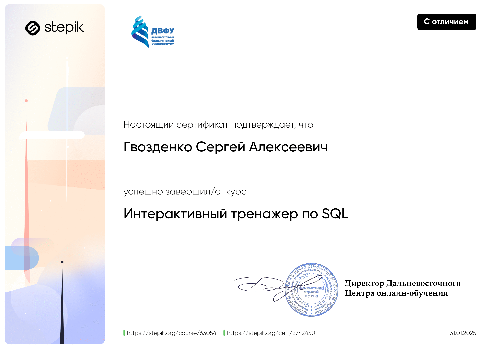
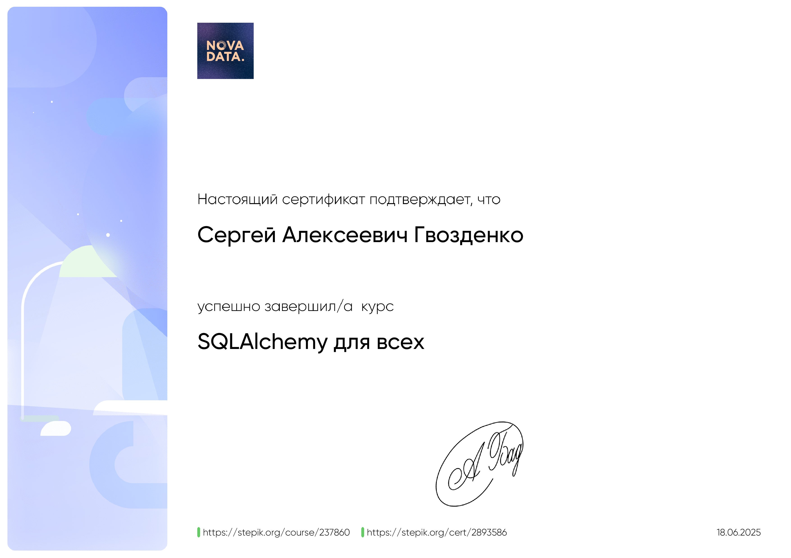

<h1 align="center">👋 Привет! Я Сергей</h1>

Добро пожаловать на мою страницу!

---
## 🔹 Обо мне
Junior Python-разработчик, специализирующийся на создании:
- Backend-сервисов
- Интеграционных решений
- Telegramm ботов
- Прикладных приложений с адаптивным GUI.

---

## 🎓 Общее образование

**Донской государственный технический университет**  
- Факультет: Менеджмент  
- Специализация: Управление предприятиями  
- Город: Ростов-на-Дону  
- Год окончания: 2015

---

## 🎓 Профильное образование

<!-- Сертификат -->
| SQL | SQLAlchemy |
|-----|------------|
|  |  |
| 🏅 SQL Certificate | 🏅 SQLAlchemy Certificate |

---

## 🛠 Hard Skills

**Backend:** Python, FastAPI, SQLAlchemy, Alembic, Docker

**Базы данных:** PostgreSQL, MySQL, SQLite  

**Проектирование:** SOLID, UML, OpenAPI  

**Паттерны проектирования:** Repository, Facade, Adapter, Factory / Abstract Factory, Observer / Publisher-Subscriber, Decorator, Controller (MVC, MVP, MVVM)  

**Интеграции:** REST API, Telegram API  

**Инструменты:** Git, pytest  

**GUI / Утилиты:** CustomTkinter, pyqt5, pyqt6  

---

## 💡 Soft Skills

- Анализ технической документации и ТЗ  
- Командная работа и коммуникация (Git workflow)  
- Самостоятельность в решении архитектурных задач  
- Внимание к тестируемости и поддерживаемости кода  
- Критическое мышление и внимание к деталям  
- Гибкость и адаптивность

---

## ✨ Технологии

<!-- Языки -->

 

<!-- GUI -->

 

<!-- Научные библиотеки / Data Science -->

 

<!-- Backend / API -->

 

<!-- AI / ML / LLM -->

 

<!-- Базы данных -->

 

<!-- Инструменты -->

 

<!-- IDE -->

---

